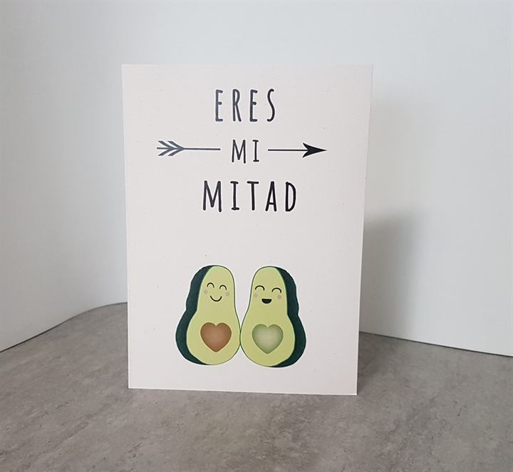
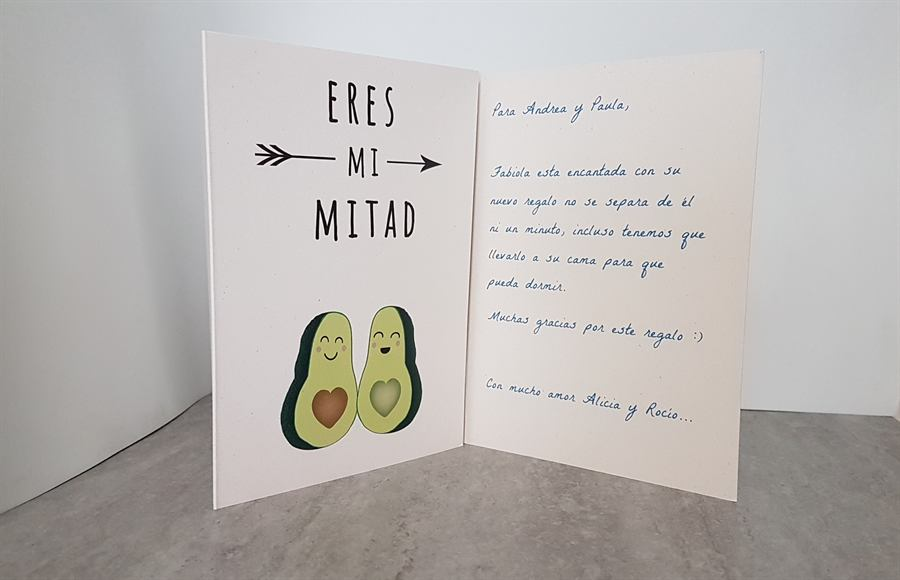

# Postalbird

**Tienda de tarjetas postales con dedicatoria manuscrita** — catálogo, editor con vista previa en vivo, pago con PayPal y panel de impresión. Web estática en HTML, CSS y JavaScript, sin frameworks ni servidor.

**Ver la web en funcionamiento: <https://postalbird.netlify.app>** (modo demostración: no se cobra nada)

<p>
  
  
</p>

> *English summary:* static e-commerce site (vanilla HTML/CSS/JS, no build step) for personalised postcards: product catalogue, live handwriting preview, PayPal checkout and an internal print panel that renders the message and envelope at real paper size.

## El proyecto

Postalbird nació en 2016 como un negocio de **Moisés y Lucía**: el cliente elige una postal, escribe su mensaje y la dirección del destinatario; ellos imprimen la dedicatoria con una letra que parece escrita a mano y la envían por correo postal.

Funcionó durante años como tienda WordPress/WooCommerce (122 postales, 101 pedidos), hasta que dejó de ser posible mantenerla. Esta versión es una **reconstrucción sin WordPress** a partir de la copia de seguridad original, pensada para no depender de servidor, base de datos ni plugins.

## Qué incluye

- **Catálogo** de 122 postales en 9 categorías, con filtros y buscador que ignora tildes, y ficha por postal.
- **Asistente de pedido** en cuatro pasos (mensaje → destinatario → envío → pago):
  - vista previa en tiempo real de la dedicatoria, el sobre y la portada, con la letra y tinta elegidas;
  - el texto se ajusta solo para caber en la hoja, con las medidas reales de impresión;
  - tarifas de envío según el país y validación de todos los campos.
- **Pago con PayPal** (SDK de JavaScript). Sin configurar, funciona en modo prueba.
- **Panel de impresión** interno: recibe el pedido desde el correo, muestra la dedicatoria y el sobre **a tamaño real**, permite ajustar milímetros según la impresora, controlar el estado del pedido y exportar a CSV.
- Diseño adaptable a móvil, accesibilidad básica, SEO (datos estructurados, sitemap) y páginas legales.

## Tecnología

HTML5 · CSS3 · JavaScript (ES2019, sin dependencias ni paso de compilación) · PayPal JS SDK · Netlify (publicación).

Los pedidos llegan por correo mediante un servicio de formularios; el pedido viaja como un código (JSON en base64) que abre el panel de impresión, así que no hace falta base de datos.

## Probarlo en local

```bash
python -m http.server 8080
```

y abre <http://localhost:8080>. La configuración (precios, PayPal, correo de pedidos) está en [`js/config.js`](js/config.js). La guía completa, en [`LEEME.md`](LEEME.md).

## Estructura

| Ruta | Contenido |
| --- | --- |
| `index.html`, `tarjetas.html`, `postal.html` | Inicio, catálogo y ficha |
| `personalizar.html`, `js/editor.js` | Asistente de pedido y pago |
| `imprimir.html`, `js/imprimir.js` | Panel de impresión |
| `js/config.js`, `js/catalog.js` | Configuración y catálogo |
| `css/`, `img/`, `fonts/` | Estilos, imágenes y tipografías |

## Notas

- La reconstrucción técnica se hizo con ayuda de **Claude Code**; el negocio, los diseños, los textos y los datos son de Moisés y Lucía.
- Las páginas legales son plantillas por completar antes de una puesta en producción real.

## Derechos

© Postalbird. **Los diseños de las postales, el logotipo, las fotografías y los textos son de sus autores y no pueden reutilizarse sin permiso.** El código se publica para consulta y como muestra de trabajo.
